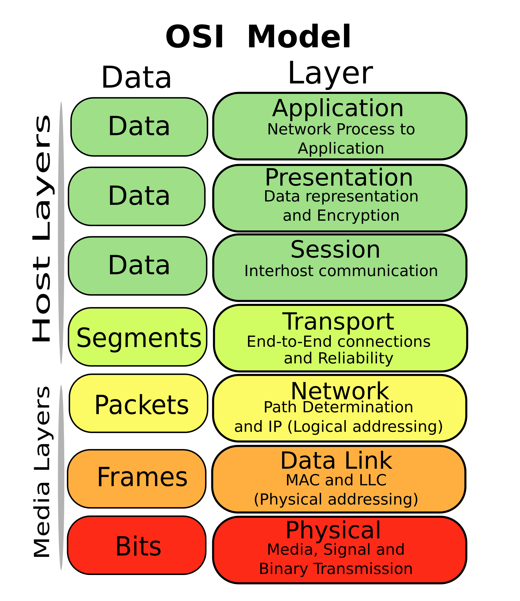

# Tugas 1 Networking Basic

- **Q** : ***OSI*** memiliki kepanjangan dari ?

  **A** : ***OSI*** sendiri merupakan singkatan dari **Open System Interconnection**, Model ini disebut juga dengan model "Model    tujuh lapis OSI" (OSI seven layer model).
          

  
   
- **Q** : Bilangan ***11011001*** merupakan contoh bentuk dari bilangan ?

  **A** : 
  
  
   
- **Q** : Bentuk desimal dari ***11011001*** adalah ?

  **A** : **11011001** = ( 1 x 27 ) + ( 1 x 26 ) + ( 0 x 25 ) + ( 1 x 24 ) + (  1 x 23 ) + ( 0 x 22 ) + ( 0 x 21 ) + ( 1 x 20 ) = **217**
  
  
   
- **Q** : Menjelaskan spesifikasi mekanis, kabel dan fungsional guna menangani data jaringan merupakan proses pada layer ?

  **A** : **Physical Layer** atau **Lapisan Fisik**, lapisan pertama dalam model referensi jaringan OSI (lapisan ini merupakan lapisan terendah) dari tujuh lapisan lainnya. Lapisan ini mendefinisikan antarmuka dan mekanisme untuk meletakkan bit-bit data di atas media jaringan (kabel, radio, atau cahaya). Selain itu, lapisan ini juga mendefinisikan tegangan listrik, arus listrik, modulasi, sinkronisasi antar bit, pengaktifan koneksi dan pemutusannya, dan beberapa karakteristik kelistrikan untuk media transmisi (seperti halnya kabel UTP/STP, kabel koaksial, atau kabel fiber-optic).   
  
   
- **Q** : Bilangan ***3f*** dan ***8a*** merupakan contoh bentuk dari bilangan ?

  **A** : Hexadecimal atau sistem bilangan basis 16 adalah sebuah sistem bilangan yang menggunakan 16 simbol dengan urutan angka sebagai berikut 0, 1, 2, 3, 4, 5, 6, 7, 8, 9, A, B, C, D, E, F.

| Jenis         | Bilangan      |
------------ | -------------
| Biner         | Content Cell  |
| Content Cell  | Content Cell  |
</center
